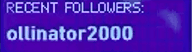

# Recent Twitch followers for OBS 
Get your most recent Twitch followers for creating a follower rotation or displaying their avatars in OBS or wherever.

## What is this?
This small console application will gather public information from your Twitch account and write it down to text files that can be used in OBS or whatever you like.

- rotate your 5 most recent followers every 8 seconds in currentFollower.txt
- create avatar thumbnails of your 5 most recent followers (avatar1.png ...)
- create single files of your followers for more flexible use (follower1.txt ...)
- create a file with your total follower count
- create a file with your stream's current viewer count
- create a fake heartbeat output with ridiculous high BPMs <- that's what it all started with! :-D

## Ok, this is like Streamlabs Labels, right?

In fact I've been using [Streamlabs Labels](https://streamlabs.com/content-hub/post/setting-up-stream-labels) before, but I wasn't able to create a recent follower rotation with their given output. So I did this thing here.

Plus this app
- works without requiring any Twitch access grants whatsoever
- does not ask for moderator role of your chat
- follows the least privilege principal
- uses the official [twitch-cli](https://github.com/twitchdev/twitch-cli) for accessing Twitch API
- runs at minimal CPU with no measurable GPU usage.

## What do I get?

Well, for example something like this:  

Please have a look at my [Twitch channel](https://twitch.tv/dichternebe1) to see it in action. I am using it to create the intro scene, the follower rotation and outro scene. And of course that heartbeat fake display!

## How does it work?
Simple!
- Download the zip file from the [Releases](https://github.com/dichternebel/recent-followers-for-obs/releases) section.
- Extract and start the executable somewhere e.g. in C:\StreamingTools
- Optional: If you want to have the output folder somewhere else, just call the executable once with a parameter pointing to that location (relative or absolute).
- Enter your Twitch username, hit enter and that's it.

If you are updating from a previous version all you have to do is to replace the .exe file.  
Please keep the application running to get the job done as long as you are streaming or working in OBS.

## What has to be done in OBS?
To get a working followers rotation you only have to add a source called **"Text(GDI+)"** to your scene in OBS and point to the text file called **"currentFollower.txt"** located in the output folder. Optionally add some nice background to it.

To get sources for your avatar followers, just add a **"Media source"** pointing to the corresponding image in the output folder. Your latest follower has avatar1.png and so on.

Enjoy!  
DichterNebel
